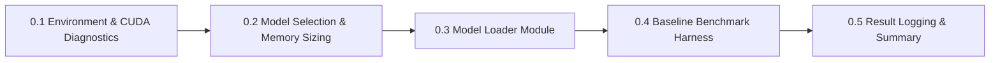

# MicroInfer Specification — Phase 0: Environment, Model Setup & Baseline Benchmarking

> **Target Hardware:** NVIDIA GeForce RTX 4050 Laptop GPU (6GB VRAM, CUDA 12.1)  
> **Primary Goal:** Build a production-grade benchmarking baseline using standard HuggingFace `.generate()` to serve as the reference control group for all future optimizations (KV-Cache, Continuous Batching, INT8 Quantization).

---

## Phase 0 Overview & Architecture

Phase 0 establishes empirical performance metrics before writing custom inference engine code. To ensure MLSys-grade statistical rigor, Phase 0 is divided into **5 sequential sub-phases**:

---

## Sub-Phase Breakdown

### Sub-Phase 0.1: Environment & GPU Hardware Diagnostics
- **Objective:** Verify CUDA runtime environment, GPU hardware specifications, and dependency isolation.
- **Key Tasks:**
  1. Verify PyTorch CUDA support (`torch.cuda.is_available() == True`).
  2. Query exact GPU device properties (`NVIDIA GeForce RTX 4050 Laptop GPU`, 6141 MiB VRAM).
  3. Create `requirements.txt` defining pinned dependencies (`torch`, `transformers`, `accelerate`, `pytest`).
  4. Setup `.gitignore` to prevent committing model checkpoints, cache files, and logs.
- **Deliverable:** Verified Python 3.11 + PyTorch `2.5.1+cu121` environment.

---

### Sub-Phase 0.2: Base Open-Weight Model Selection & VRAM Memory Sizing
- **Objective:** Select an optimal open-weight Transformer model that fits comfortably within 6GB VRAM while providing realistic benchmark signals.
- **Selected Model:** `Qwen/Qwen2.5-1.5B-Instruct`
- **Memory Footprint Calculations:**
  - **Parameters:** ~1.54 Billion parameters.
  - **Precision:** FP16 (2 bytes per parameter).
  - **Model Weight Size:** $1.54 \times 10^9 \times 2 \text{ bytes} \approx 3.08 \text{ GB}$.
  - **Remaining Headroom:** $6.0 \text{ GB} - 3.1 \text{ GB} \approx 2.9 \text{ GB}$ available for KV-cache tensors, batch buffers, and PyTorch overhead.
- **Deliverable:** Memory sizing report confirming 3.08 GB model allocation on RTX 4050.

---

### Sub-Phase 0.3: Unified Model Loader Engine Implementation (`src/model_loader.py`)
- **Objective:** Implement a reusable, modular function to load tokenizers and model weights onto CUDA with VRAM diagnostics.
- **Key Tasks:**
  1. Build `load_model_and_tokenizer(model_id, device, dtype)` in `src/model_loader.py`.
  2. Handle tokenizer padding/EOS token assignments (`tokenizer.pad_token = tokenizer.eos_token`).
  3. Measure wall-clock model loading time.
  4. Log allocated vs reserved VRAM (`torch.cuda.memory_allocated()`, `torch.cuda.memory_reserved()`).
- **Deliverable:** Modular `src/model_loader.py` utility.

---

### Sub-Phase 0.4: Baseline Benchmarking Harness Construction (`benchmarks/baseline_hf.py`)
- **Objective:** Construct a benchmark suite that measures generation latency, throughput, and peak memory under controlled conditions.
- **Core Engineering Requirements:**
  1. **Warm-Up Execution:** Run 1 discarded generation to initialize CUDA context and compile kernels.
  2. **TTFT (Time-To-First-Token):** Measure prompt processing latency (ms) for the initial generated token.
  3. **TPOT (Time-Per-Output-Token):** Measure average generation latency (ms/token) for tokens $2 \dots N$.
  4. **Throughput Calculation:** Calculate system-wide generation rate ($\text{tokens/sec} = \frac{\text{Generated Tokens}}{\text{Total Time}}$).
  5. **Peak Memory Tracking:** Capture max VRAM usage (`torch.cuda.max_memory_allocated()`).
  6. **Greedy Decoding:** Enforce `do_sample=False` for 100% deterministic benchmarking.
- **Deliverable:** Standardized benchmark runner `benchmarks/baseline_hf.py`.

---

### Sub-Phase 0.5: Automated Result Logging & Baseline Report Generation
- **Objective:** Persist structured JSON benchmark data and populate the master project documentation.
- **Key Tasks:**
  1. Export raw benchmark results to `benchmarks/results/phase0_baseline_hf.json`.
  2. Update `README.md` with baseline metrics in the master comparison table.
  3. Commit initial Phase 0 codebase to Git and push to GitHub remote repository (`main` branch).
- **Deliverable:** `phase0_baseline_hf.json` + committed Git history.

---

## Summary of Phase 0 Deliverables Matrix

| Sub-Phase | Component | Target File / Artifact | Status |
| :--- | :--- | :--- | :---: |
| **0.1** | GPU & Environment Checks | `requirements.txt`, `.gitignore` | Complete |
| **0.2** | Model Selection (Qwen 1.5B) | `PHASE0_SPEC.md` | Complete |
| **0.3** | Model Loader Module | `src/model_loader.py` | Complete |
| **0.4** | Baseline Benchmark Harness | `benchmarks/baseline_hf.py` | Complete |
| **0.5** | Benchmark Results & Report | `benchmarks/results/phase0_baseline_hf.json` | Complete |

---

## Interview Readiness Note (MLSys / AI Infra Roles)

In technical interviews at FAANG / AI Labs (OpenAI, Anthropic, DeepMind), Phase 0 answers the foundational question:
> *"What is your baseline benchmark methodology, and how did you isolate model framework overhead from GPU memory bandwidth bottlenecks?"*
