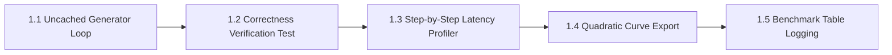

# MicroInfer Specification — Phase 1: Naive Forward-Pass Generation (No Cache)

> **Target Hardware:** NVIDIA GeForce RTX 4050 Laptop GPU (6GB VRAM, CUDA 12.1)  
> **Primary Goal:** Implement an uncached custom generation loop from first principles to demonstrate and measure the $\mathcal{O}(n^2)$ quadratic slowdown penalty of recomputing attention Key and Value projections on every token generation step.

---

## 📌 Phase 1 Overview & Architecture

Without a Key-Value (KV) cache, generating token $N+1$ requires running the full model forward pass over all preceding tokens $1 \dots N$ again from scratch. The total attention computation across $N$ generated tokens scales quadratically:

$$\text{Total Attention Flops} \propto \sum_{i=1}^{N} i^2 = \frac{N(N+1)(2N+1)}{6} \approx \mathcal{O}(N^3) \text{ total FLOPs / } \mathcal{O}(N^2) \text{ per-token latency}$$

Phase 1 is divided into **5 sequential sub-phases**:

---

## 🛠️ Sub-Phase Breakdown

### 🔹 Sub-Phase 1.1: Uncached Token Generation Loop Design (`src/naive_generate.py`)
- **Objective:** Implement a pure PyTorch generation loop without any KV-caching.
- **Key Algorithmic Steps:**
  1. Tokenize input prompt string into tensor `generated` of shape `(1, prompt_len)`.
  2. For step $i = 1 \dots \text{max\_new\_tokens}$:
     - Execute `outputs = model(generated)` (recomputes full sequence $1 \dots i$).
     - Extract logits at the last sequence position: `next_token_logits = outputs.logits[:, -1, :]`.
     - Select next token ID via greedy argmax: `next_token = torch.argmax(next_token_logits, dim=-1, keepdim=True)`.
     - Concatenate: `generated = torch.cat([generated, next_token], dim=1)`.
     - Synchronize CUDA clock (`torch.cuda.synchronize()`) and log step latency $t_i$.
     - Break if `next_token == tokenizer.eos_token_id`.
- **Deliverable:** Working [src/naive_generate.py](file:///c:/Users/LENOVO/Desktop/MICROINFER/src/naive_generate.py) module.

---

### 🔹 Sub-Phase 1.2: Correctness Verification Suite (`tests/test_correctness.py`)
- **Objective:** Prove token-level equivalence between custom `naive_generate()` and standard HuggingFace `.generate()` baseline.
- **Key Tasks:**
  1. Set `temperature=0.0` (greedy decoding) on both generators.
  2. Compare token IDs generated for identical prompts.
  3. Assert string equality: `assert naive_output.strip() == hf_output.strip()`.
- **Deliverable:** PyTest suite [tests/test_correctness.py](file:///c:/Users/LENOVO/Desktop/MICROINFER/tests/test_correctness.py).

---

### 🔹 Sub-Phase 1.3: Step-by-Step Latency Profiling Harness (`benchmarks/benchmark_naive.py`)
- **Objective:** Measure per-token latency $t_1, t_2, \dots, t_N$ across generation sequence lengths ($N \in \{16, 32, 64, 128, 256\}$).
- **Key Metrics Captured:**
  1. **Step Latency Curve ($t_i$ vs $i$):** Per-token execution time as context window grows.
  2. **TTFT (Time-To-First-Token):** Step 1 latency (ms).
  3. **TPOT (Time-Per-Output-Token):** Mean step latency across generated tokens.
  4. **Overall Throughput:** $\text{tokens/sec} = \frac{\text{Generated Tokens}}{\sum t_i}$.
- **Deliverable:** Dedicated benchmark script `benchmarks/benchmark_naive.py`.

---

### 🔹 Sub-Phase 1.4: Quadratic Slowdown Data Export & Plotting
- **Objective:** Export raw step timings to JSON and generate visual latency growth charts.
- **Key Tasks:**
  1. Save raw per-step measurements to `benchmarks/results/phase1_naive.json`.
  2. Generate line chart showing quadratic step-time growth vs linear sequence index.
- **Deliverable:** `phase1_naive.json` + `analysis/plots/phase1_quadratic_scaling.png`.

---

### 🔹 Sub-Phase 1.5: Master Benchmark Table Update & Gap Analysis
- **Objective:** Update `README.md` master comparison table and document the mechanistic cause of uncached slowdown.
- **Key Tasks:**
  1. Populate Phase 1 metrics (TTFT, TPOT, Throughput, Peak VRAM) in `README.md`.
  2. Write gap analysis detailing why $Q, K, V$ projection re-computation degrades performance at higher sequence lengths.
- **Deliverable:** Updated `README.md` + Git commit.

---

## 📈 Summary of Phase 1 Deliverables Matrix

| Sub-Phase | Component | Target File / Artifact | Status |
| :--- | :--- | :--- | :---: |
| **1.1** | Uncached Generator Loop | `src/naive_generate.py` | ✅ Complete |
| **1.2** | Correctness Test Suite | `tests/test_correctness.py` | ✅ Complete |
| **1.3** | Latency Profiler Harness | `benchmarks/benchmark_naive.py` | ✅ Complete |
| **1.4** | Quadratic Data Export | `benchmarks/results/phase1_naive.json` | ✅ Complete |
| **1.5** | Master Table Logging | `README.md` | ✅ Complete |

---

## 💡 Interview Readiness Note (MLSys / AI Infra Roles)

In technical interviews at OpenAI, Anthropic, or DeepMind:
> *"Why does uncached autoregressive generation degrade quadratically, and what is the exact memory bandwidth vs compute bottleneck at step $N$?"*
> 
> You answer:
> *"Without KV-caching, every new token requires re-projecting all $N$ previous tokens through $W_q, W_k, W_v$ matrices in every transformer layer. The GEMM dimensions scale as $(1 \times d_{\text{model}}) \times (d_{\text{model}} \times d_{\text{model}})$ on step 1, but grow to $(N \times d_{\text{model}}) \times (d_{\text{model}} \times d_{\text{model}})$ on step $N$, creating an $\mathcal{O}(N^2)$ re-computation penalty."*
