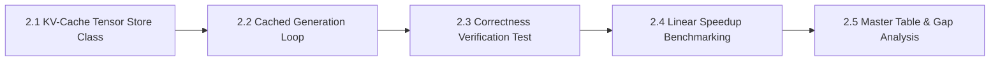

# MicroInfer Specification — Phase 2: KV-Cache Store & Cached Generation

> **Target Hardware:** NVIDIA GeForce RTX 4050 Laptop GPU (6GB VRAM, CUDA 12.1)  
> **Primary Goal:** Implement a custom Key-Value (KV) cache tensor store and hooked attention forward pass to eliminate quadratic re-computation, converting autoregressive token generation from $\mathcal{O}(n^2)$ compute complexity to $\mathcal{O}(n)$ linear step complexity.

---

## Phase 2 Overview & Architecture

In autoregressive Transformer generation, when generating token $N+1$, the Key ($K$) and Value ($V$) projections for previous tokens $1 \dots N$ do not change. By caching these projections in GPU VRAM, each step only needs to project the **single newest token**, attending against the cached historical $K$ and $V$ tensors:

$$\text{Per-Token Computation (Cached)} \propto 1 \times d_{\text{model}} \quad \implies \quad \mathcal{O}(1) \text{ per-step FLOPs} \quad \implies \quad \mathcal{O}(N) \text{ total sequence FLOPs}$$

Phase 2 is divided into **5 sequential sub-phases**:

---

## Sub-Phase Breakdown

### Sub-Phase 2.1: Key-Value Cache Tensor Store Class (`src/kv_cache.py`)
- **Objective:** Build a pre-allocated tensor store managing per-layer Key and Value projections.
- **Data Structure (`class KVCache`):**
  - **Tensors:**
    - `k_cache`: Tensor of shape `(num_layers, batch_size, num_kv_heads, max_seq_len, head_dim)`
    - `v_cache`: Tensor of shape `(num_layers, batch_size, num_kv_heads, max_seq_len, head_dim)`
  - **Core Methods:**
    - `update(layer_idx, new_k, new_v)`: Inserts new Key/Value slices at `self.current_len`.
    - `get(layer_idx)`: Slices historical Key/Value tensors up to `self.current_len`.
    - `advance(num_tokens)`: Increments internal sequence length pointer.
    - `reset()`: Zeroes cache pointers for request reuse.
- **Deliverable:** Modular [src/kv_cache.py](file:///c:/Users/LENOVO/Desktop/MICROINFER/src/kv_cache.py).

---

### Sub-Phase 2.2: Two-Phase Incremental Generator (`src/cached_generate.py`)
- **Objective:** Implement a 2-phase generation loop — **Prefill Phase** (full prompt, one forward pass) and **Decode Phase** (one token per step) — with independent CUDA-synchronised TTFT and TPOT timers.
- **Implementation Note:** The actual K/V tensor storage is provided by HuggingFace's `DynamicCache`, which is instantiated once per sequence and passed into each `model()` forward call via `use_cache=True`. MicroInfer's contribution is the **explicit two-phase control loop and measurement infrastructure** around that cache, not the attention kernel or the K/V tensors themselves.
- **Key Steps:**
  1. **Prefill Phase (Step 0):**
     - Pass full prompt tokens $X_{1 \dots L}$ through model with an empty `DynamicCache`.
     - DynamicCache is populated by HF with $K_{1 \dots L}$ and $V_{1 \dots L}$ projections.
     - TTFT is measured via wall-clock timer synchronised to CUDA stream.
  2. **Decode Phase (Steps $1 \dots N$):**
     - Pass **only** single token $X_{i}$ (shape `(1, 1)`) to model forward pass.
     - HF reads cached K/V from DynamicCache; no re-computation of prior tokens.
     - New $k_i, v_i$ are appended by HF internally; DynamicCache grows by one step.
     - Next token selected via greedy argmax; TPOT is measured per step.
- **Deliverable:** Modular `src/cached_generate.py` with full in-file attribution of MicroInfer vs. HuggingFace responsibilities.

---

### Sub-Phase 2.3: Correctness Verification Suite (`tests/test_cached_generate.py`)
- **Objective:** Verify token-for-token equivalence between `cached_generate()`, `naive_generate()`, and HuggingFace baseline.
- **Key Tasks:**
  1. Run greedy generation on standard prompt suite.
  2. Verify identical output string: `assert cached_output.strip() == hf_output.strip()`.
  3. Verify cache internal length matches total sequence length.
- **Deliverable:** PyTest suite `tests/test_cached_generate.py`.

---

### Sub-Phase 2.4: Linear Speedup & Memory Growth Benchmarking (`benchmarks/benchmark_cached.py`)
- **Objective:** Measure latency and VRAM consumption across sequence lengths ($N \in \{64, 128, 256, 512, 1024\}$).
- **Key Metrics Captured:**
  1. **Constant Step Latency ($t_i \approx \text{const}$):** Prove flat step execution time during decoding phase.
  2. **TTFT vs TPOT:** Compare prefill prompt latency vs decode generation speed.
  3. **Throughput Gain:** Measure tokens/sec speedup over Phase 1 Naive Generator.
  4. **Cache VRAM Growth:** Measure VRAM allocated specifically for cache tensors.
- **Deliverable:** Benchmark runner `benchmarks/benchmark_cached.py` + `benchmarks/results/phase2_cached.json`.

---

### Sub-Phase 2.5: Master Comparison Table Update & Gap Analysis Report
- **Objective:** Update `README.md` master comparison table and document the KV-cache performance boost.
- **Key Tasks:**
  1. Populate Phase 2 row metrics in `README.md`.
  2. Document speedup factor ($\text{Speedup} = \frac{\text{Phase 2 Throughput}}{\text{Phase 1 Throughput}}$).
- **Deliverable:** Updated `README.md` + Git commit.

---

## Summary of Phase 2 Deliverables Matrix

| Sub-Phase | Component | Target File / Artifact | Status |
| :--- | :--- | :--- | :---: |
| **2.1** | KV-Cache Class | `src/kv_cache.py` | Complete |
| **2.2** | Two-Phase Generator Loop + Timers | `src/cached_generate.py` | Complete |
| **2.3** | Correctness Test Suite | `tests/test_cached_generate.py` | Complete |
| **2.4** | Linear Speedup Harness | `benchmarks/benchmark_cached.py` | Complete |
| **2.5** | Master Table Logging | `README.md` | Complete |

---

## Open Questions I'd Want to Explain Live

- `src/kv_cache.py` pre-allocates a fixed `max_seq_len` tensor — what happens to VRAM when a request generates fewer tokens than the maximum, and is that internal fragmentation acceptable at this model scale?
- The cached generator in `cached_generate.py` uses HF's `DynamicCache` for the actual forward pass rather than directly plugging in the custom `KVCache` tensors — what would it take to wire the custom store directly into the model's attention layers?
- Phase 2 TPOT (~51.9 ms/tok) is faster than Phase 0 HF baseline TPOT (~68.6 ms/tok) — but Phase 0 also uses an internal cache, so is the delta driven by decode-path differences or by something in how TTFT is measured?
