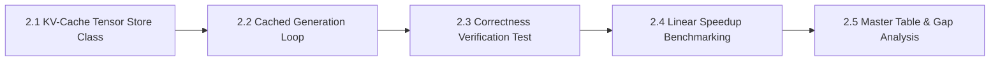

# MicroInfer Specification — Phase 2: KV-Cache Store & Cached Generation

> **Target Hardware:** NVIDIA GeForce RTX 4050 Laptop GPU (6GB VRAM, CUDA 12.1)  
> **Primary Goal:** Implement a custom Key-Value (KV) cache tensor store and hooked attention forward pass to eliminate quadratic re-computation, converting autoregressive token generation from $\mathcal{O}(n^2)$ compute complexity to $\mathcal{O}(n)$ linear step complexity.

---

## 📌 Phase 2 Overview & Architecture

In autoregressive Transformer generation, when generating token $N+1$, the Key ($K$) and Value ($V$) projections for previous tokens $1 \dots N$ do not change. By caching these projections in GPU VRAM, each step only needs to project the **single newest token**, attending against the cached historical $K$ and $V$ tensors:

$$\text{Per-Token Computation (Cached)} \propto 1 \times d_{\text{model}} \quad \implies \quad \mathcal{O}(1) \text{ per-step FLOPs} \quad \implies \quad \mathcal{O}(N) \text{ total sequence FLOPs}$$

Phase 2 is divided into **5 sequential sub-phases**:

---

## 🛠️ Sub-Phase Breakdown

### 🔹 Sub-Phase 2.1: Key-Value Cache Tensor Store Class (`src/kv_cache.py`)
- **Objective:** Build a pre-allocated tensor store managing per-layer Key and Value projections.
- **Data Structure (`class KVCache`):**
  - **Tensors:**
    - `k_cache`: Tensor of shape `(num_layers, batch_size, num_kv_heads, max_seq_len, head_dim)`
    - `v_cache`: Tensor of shape `(num_layers, batch_size, num_kv_heads, max_seq_len, head_dim)`
  - **Core Methods:**
    - `update(layer_idx, new_k, new_v)`: Inserts new Key/Value slices at `self.current_len`.
    - `get(layer_idx)`: Slices historical Key/Value tensors up to `self.current_len`.
    - `advance(num_tokens)`: Increments internal sequence length pointer.
    - `reset()`: Zeroes cache pointers for request reuse.
- **Deliverable:** Modular [src/kv_cache.py](file:///c:/Users/LENOVO/Desktop/MICROINFER/src/kv_cache.py).

---

### 🔹 Sub-Phase 2.2: Attention Layer Hooking & Incremental Generator (`src/cached_generate.py`)
- **Objective:** Implement a 2-phase generation loop: **Prefill Phase** (processes full prompt) and **Decode Phase** (processes 1 token per step).
- **Key Algorithmic Steps:**
  1. **Prefill Phase (Step 0):**
     - Pass prompt tokens $X_{1 \dots L}$ through model.
     - Store initial $K_{1 \dots L}$ and $V_{1 \dots L}$ projections into `KVCache`.
     - Advance cache position by $L$.
  2. **Decode Phase (Steps $1 \dots N$):**
     - Pass **only** single token $X_{i}$ (shape `(1, 1)`) to model forward pass.
     - Compute new Key $k_i$ and Value $v_i$ projections.
     - Append $k_i, v_i$ to cache via `update(layer_idx, new_k, new_v)`.
     - Compute multi-head attention: $\text{Softmax}\left(\frac{q_i \cdot K_{1 \dots i}^T}{\sqrt{d_k}}\right) V_{1 \dots i}$.
     - Select next token ID via greedy argmax.
     - Set `current_input = next_token`.
- **Deliverable:** Modular `src/cached_generate.py`.

---

### 🔹 Sub-Phase 2.3: Correctness Verification Suite (`tests/test_cached_generate.py`)
- **Objective:** Verify token-for-token equivalence between `cached_generate()`, `naive_generate()`, and HuggingFace baseline.
- **Key Tasks:**
  1. Run greedy generation on standard prompt suite.
  2. Verify identical output string: `assert cached_output.strip() == hf_output.strip()`.
  3. Verify cache internal length matches total sequence length.
- **Deliverable:** PyTest suite `tests/test_cached_generate.py`.

---

### 🔹 Sub-Phase 2.4: Linear Speedup & Memory Growth Benchmarking (`benchmarks/benchmark_cached.py`)
- **Objective:** Measure latency and VRAM consumption across sequence lengths ($N \in \{64, 128, 256, 512, 1024\}$).
- **Key Metrics Captured:**
  1. **Constant Step Latency ($t_i \approx \text{const}$):** Prove flat step execution time during decoding phase.
  2. **TTFT vs TPOT:** Compare prefill prompt latency vs decode generation speed.
  3. **Throughput Gain:** Measure tokens/sec speedup over Phase 1 Naive Generator.
  4. **Cache VRAM Growth:** Measure VRAM allocated specifically for cache tensors.
- **Deliverable:** Benchmark runner `benchmarks/benchmark_cached.py` + `benchmarks/results/phase2_cached.json`.

---

### 🔹 Sub-Phase 2.5: Master Comparison Table Update & Gap Analysis Report
- **Objective:** Update `README.md` master comparison table and document the KV-cache performance boost.
- **Key Tasks:**
  1. Populate Phase 2 row metrics in `README.md`.
  2. Document speedup factor ($\text{Speedup} = \frac{\text{Phase 2 Throughput}}{\text{Phase 1 Throughput}}$).
- **Deliverable:** Updated `README.md` + Git commit.

---

## 📈 Summary of Phase 2 Deliverables Matrix

| Sub-Phase | Component | Target File / Artifact | Status |
| :--- | :--- | :--- | :---: |
| **2.1** | KV-Cache Class | `src/kv_cache.py` | ✅ Complete |
| **2.2** | Cached Generator Loop | `src/cached_generate.py` | ✅ Complete |
| **2.3** | Correctness Test Suite | `tests/test_cached_generate.py` | ✅ Complete |
| **2.4** | Linear Speedup Harness | `benchmarks/benchmark_cached.py` | ✅ Complete |
| **2.5** | Master Table Logging | `README.md` | ✅ Complete |

---

## 💡 Interview Readiness Note (MLSys / AI Infra Roles)

In technical interviews at OpenAI, Anthropic, or DeepMind:
> *"What is the exact tensor layout of a KV-cache, how does Grouped-Query Attention (GQA) reduce cache size, and why does caching convert a compute-bound operation into a memory-bandwidth-bound operation during decoding?"*
> 
> You answer:
> *"During the decoding phase, feeding a single token means the GEMM compute is tiny ($1 \times d_{\text{model}}$), but we must read the entire historical $K$ and $V$ cache tensors from GPU VRAM to HBM on every step. Thus, decoding speed is limited by GPU Memory Bandwidth (GB/s), not TFLOPS. Grouped-Query Attention reduces the number of KV heads from $H_q$ to $H_{kv}$ (e.g. 12 Q heads to 2 KV heads in Qwen 1.5B), shrinking KV-cache VRAM read bandwidth requirement by $6\times$."*
