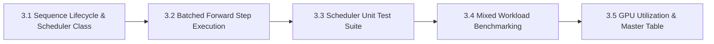

# MicroInfer Specification — Phase 3: Continuous Batching Scheduler

> **Target Hardware:** NVIDIA GeForce RTX 4050 Laptop GPU (6GB VRAM, CUDA 12.1)  
> **Primary Goal:** Implement an in-flight **Continuous Batching Scheduler** that dynamically admits new incoming generation requests and evicts completed sequences on every generation step, eliminating static batch padding waste and maximizing GPU Tensor Core utilization.

---

## 📌 Phase 3 Overview & Architecture

In production LLM serving, users send requests at different times with different prompt lengths and desired output lengths. **Static batching** waits for a fixed batch to collect, runs all sequences to completion, and leaves GPU Tensor Cores idling while shorter requests finish early. **Continuous batching** (in-flight batching) operates at the iteration step level:

```
Step t:   [Seq A (step 12)] [Seq B (step 5)]  [Seq C (step 1)]  <-- New request joined!
Step t+1: [Seq A (FINISHED)] [Seq B (step 6)] [Seq C (step 2)]  <-- Seq A evicted, slot freed!
```

Phase 3 is divided into **5 sequential sub-phases**:



---

## 🛠️ Sub-Phase Breakdown

### 🔹 Sub-Phase 3.1: Sequence Lifecycle & Scheduler Data Structure (`src/scheduler.py`)
- **Objective:** Build request data structures and queue management logic.
- **Data Structures:**
  - **`SequenceState` Enum:** `WAITING`, `RUNNING`, `FINISHED`.
  - **`Sequence` Dataclass:** `seq_id`, `prompt_tokens`, `generated_tokens`, `state`, `max_new_tokens`, `cache_slot`.
  - **`ContinuousBatchScheduler` Class:** Manages `waiting_queue`, `running_batch`, `max_batch_size`, and `cache_pool`.
- **Deliverable:** Core [src/scheduler.py](file:///c:/Users/LENOVO/Desktop/MICROINFER/src/scheduler.py) classes.

---

### 🔹 Sub-Phase 3.2: Batched Tensor Forward-Pass Execution Engine
- **Objective:** Implement step-level iteration: admission, batched forward tensor execution, and eviction.
- **Key Algorithmic Step (`scheduler.step(model)`):**
  1. **Admission:** If `len(running_batch) < max_batch_size` and `waiting_queue` has requests, pop request, allocate cache slot, set `state = RUNNING`, add to `running_batch`.
  2. **Batched Execution:** Stack current input token IDs of all active sequences into batch tensor `(B, 1)`. Run single `model(batched_inputs)` call.
  3. **Unstacking & Eviction:** Sample next token for each sequence. If token is EOS or reached `max_new_tokens`, set `state = FINISHED`, free cache slot, and remove from `running_batch`.
- **Deliverable:** Batched execution engine in `src/scheduler.py`.

---

### 🔹 Sub-Phase 3.3: Scheduler Correctness & Lifecycle Unit Test Suite (`tests/test_scheduler.py`)
- **Objective:** Verify request admission, eviction, dynamic slots, and multi-sequence correctness.
- **Key Tasks:**
  1. Test single and multi-request queue processing.
  2. Verify completed sequences vacate cache slots for waiting requests.
  3. Assert output text validity across concurrent requests.
- **Deliverable:** PyTest suite `tests/test_scheduler.py`.

---

### 🔹 Sub-Phase 3.4: Mixed Workload GPU Utilization Benchmarking (`benchmarks/benchmark_scheduler.py`)
- **Objective:** Benchmark continuous batching vs static batching under staggered request arrivals and varying lengths.
- **Key Metrics Captured:**
  1. **Aggregate Throughput:** Total tokens generated across all concurrent requests per second.
  2. **GPU Utilization (%):** Sampled via `nvidia-smi` / PyTorch CUDA events during run.
  3. **TTFT & TPOT under Load:** Latency per request under concurrent batching.
  4. **Peak VRAM:** Max memory allocated during multi-sequence batching.
- **Deliverable:** Benchmark runner `benchmarks/benchmark_scheduler.py` + `benchmarks/results/phase3_scheduler.json`.

---

### 🔹 Sub-Phase 3.5: Master Comparison Table Update & Gap Analysis Report
- **Objective:** Update `README.md` master comparison table, plot GPU utilization charts, and report batching efficiency.
- **Key Tasks:**
  1. Generate GPU utilization bar chart `analysis/plots/phase3_gpu_utilization.png`.
  2. Record Phase 3 metrics in `README.md`.
  3. Document continuous batching throughput gains in `analysis/ANALYSIS.md`.
- **Deliverable:** Updated `README.md` + `ANALYSIS.md` + Git commit.

---

## 📈 Summary of Phase 3 Deliverables Matrix

| Sub-Phase | Component | Target File / Artifact | Status |
| :--- | :--- | :--- | :---: |
| **3.1** | Scheduler Data Structure | `src/scheduler.py` | ✅ Complete |
| **3.2** | Batched Forward Engine | `src/scheduler.py` | ✅ Complete |
| **3.3** | Scheduler Unit Tests | `tests/test_scheduler.py` | ✅ Complete |
| **3.4** | Mixed Workload Benchmark | `benchmarks/benchmark_scheduler.py` | ✅ Complete |
| **3.5** | Master Table & Utilization Plot | `README.md` | ✅ Complete |

---

## 💡 Interview Readiness Note (MLSys / AI Infra Roles)

In technical interviews at OpenAI, Anthropic, or DeepMind:
> *"How does continuous batching differ from static batching, and how do you handle variable prompt lengths during the prefill phase vs single-token decoding steps in a batched forward pass?"*
> 
> You answer:
> *"Static batching suffers from the 'straggler problem' where the entire batch is held hostage by the longest sequence. Continuous batching operates at iteration granularity. For variable prompt lengths during prefill, requests are processed using attention masking or separate prefill steps, while decoding requests process uniform $(B, 1)$ single-token inputs per step, allowing new requests to join the running batch dynamically as soon as a cache slot opens up."*
