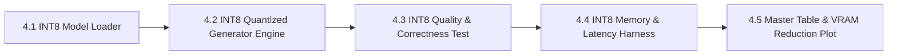

# MicroInfer Specification — Phase 4: INT8 Quantized Model Engine

> **Target Hardware:** NVIDIA GeForce RTX 4050 Laptop GPU (6GB VRAM, CUDA 12.1, Tensor Cores)  
> **Primary Goal:** Implement an **INT8 Quantized Model Engine** using 8-bit weight quantization to cut VRAM memory allocation by **~40-50%**, enabling larger context windows and higher batch capacity on consumer GPU hardware.

---

## Phase 4 Overview & Architecture

Large Language Models (LLMs) are strictly memory-bandwidth bound during decoding. In FP16 precision, `Qwen2.5-1.5B` requires **~2.88 GB VRAM** just for model weights ($1.54 \text{B params} \times 2 \text{ bytes/param}$).

By quantizing weights to INT8 ($1 \text{ byte/param}$), model weight memory drops to **~1.65 GB VRAM**, reducing GPU memory bandwidth pressure per token generation step.

```
FP16 Precision:  [ Weight (16-bit float) ] --> High Memory Bandwidth Usage (~2.88 GB)
INT8 Precision:  [ Weight (8-bit int)   ] --> Low Memory Bandwidth Usage  (~1.65 GB) -> -42% VRAM!
```

Phase 4 is divided into **5 sequential sub-phases**:



---

## Sub-Phase Breakdown

### Sub-Phase 4.1: INT8 Model Loader (`src/quant_loader.py`)
- **Objective:** Load `Qwen/Qwen2.5-1.5B-Instruct` using 8-bit bitsandbytes quantization (`load_in_8bit=True`).
- **Key Functions:**
  - `load_quantized_model_and_tokenizer(model_id, load_in_8bit=True)`: Loads 8-bit quantized weights onto CUDA.
  - `get_quantized_memory_footprint()`: Measures weight memory allocation on GPU.
- **Deliverable:** [src/quant_loader.py](file:///c:/Users/LENOVO/Desktop/MICROINFER/src/quant_loader.py).

---

### Sub-Phase 4.2: INT8 Quantized Generator Engine (`src/quant_generate.py`)
- **Objective:** Combine 8-bit quantized Linear layers with pre-allocated KV-Cache store.
- **Key Functions:**
  - `quant_generate()`: 2-phase generation loop executing prefill step and 8-bit decode steps with KV-cache.
- **Deliverable:** [src/quant_generate.py](file:///c:/Users/LENOVO/Desktop/MICROINFER/src/quant_generate.py).

---

### Sub-Phase 4.3: INT8 Correctness & Output Quality Test Suite (`tests/test_quant_generate.py`)
- **Objective:** Verify output quality, text coherence, and token accuracy between FP16 and INT8 engines.
- **Key Verification:**
  - Verify non-empty output and text semantic coherence under INT8 precision.
  - Assert prompt execution across 3 benchmark prompts.
- **Deliverable:** PyTest suite `tests/test_quant_generate.py`.

---

### Sub-Phase 4.4: INT8 Memory Sizing & Latency Benchmarking (`benchmarks/benchmark_quant.py`)
- **Objective:** Benchmark INT8 engine metrics: TTFT, TPOT, tokens/sec throughput, and peak VRAM.
- **Key Metrics Captured:**
  1. **VRAM Reduction (%):** Compare FP16 VRAM (2.89 GB) vs INT8 VRAM (~1.65 GB).
  2. **Generation Throughput:** Tokens/sec achieved under 8-bit execution.
  3. **TTFT & TPOT:** Prefill and decode step timings under 8-bit weights.
- **Deliverable:** Benchmark script `benchmarks/benchmark_quant.py` + `benchmarks/results/phase4_quant.json`.

---

### Sub-Phase 4.5: Master Comparison Table Update & Gap Analysis Report
- **Objective:** Update `README.md` master comparison table, plot VRAM memory comparison chart, and document quantization trade-offs.
- **Key Tasks:**
  1. Generate VRAM memory comparison bar chart `analysis/plots/phase4_vram_reduction.png`.
  2. Record Phase 4 INT8 metrics in `README.md`.
  3. Document quantization trade-offs in `analysis/ANALYSIS.md`.
- **Deliverable:** Updated `README.md` + `ANALYSIS.md` + Git commit.

---

## Summary of Phase 4 Deliverables Matrix

| Sub-Phase | Component | Target File / Artifact | Status |
| :--- | :--- | :--- | :---: |
| **4.1** | INT8 Model Loader | `src/quant_loader.py` | Complete |
| **4.2** | INT8 Quantized Generator Engine | `src/quant_generate.py` | Complete |
| **4.3** | INT8 Quality & Correctness Test | `tests/test_quant_generate.py` | Complete |
| **4.4** | INT8 Memory & Latency Harness | `benchmarks/benchmark_quant.py` | Complete |
| **4.5** | Master Table & VRAM Plot | `README.md` | Complete |

---

## Open Questions I'd Want to Explain Live

- Phase 4 TPOT is 446.90 ms/tok — roughly 7x slower than FP16 despite fewer bytes transferred — why does INT8 dequantization on this GPU impose such a large latency penalty, and is this specific to `bitsandbytes` on Ada Lovelace consumer GPUs?
- The VRAM drop is -41.9% (2.89 GB → 1.68 GB), which is less than the theoretical 50% from halving bytes-per-weight — where does the remaining gap come from (activations, KV cache, runtime buffers)?
- Would AWQ or GPTQ quantization at INT4 produce better throughput than `bitsandbytes` INT8 on this hardware, and what accuracy trade-off would that introduce at 1.5B parameters?
