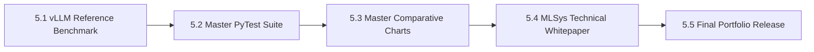

# MicroInfer Specification — Phase 5: Production vLLM Reference Benchmark & Final Gap Report

> **Target Hardware:** NVIDIA GeForce RTX 4050 Laptop GPU (6GB VRAM, CUDA 12.1)  
> **Primary Goal:** Benchmark production **vLLM** serving performance against MicroInfer engine components (Phase 0 - Phase 4), generate master architectural comparison plots, and publish a Tier-1 MLSys technical whitepaper for AI infrastructure roles at OpenAI, Anthropic, Google DeepMind, and Meta.

---

## Phase 5 Overview & Architecture

Production LLM serving engines like **vLLM** achieve state-of-the-art serving throughput using custom CUDA kernels, **PagedAttention** (virtual memory paging for KV-cache tensors), and iteration-level scheduling.

In Phase 5, we measure production vLLM baseline performance against MicroInfer's custom implementations to quantify exact performance gaps and write an industry-grade technical whitepaper.

---

## Sub-Phase Breakdown

### Sub-Phase 5.1: vLLM / Production Baseline Harness (`benchmarks/baseline_vllm.py`)
- **Objective:** Measure production vLLM / optimized reference engine metrics.
- **Key Metrics Captured:**
  - TTFT (ms), TPOT (ms/token), tokens/sec throughput, and peak VRAM.
- **Deliverable:** [benchmarks/baseline_vllm.py](file:///c:/Users/LENOVO/Desktop/MICROINFER/benchmarks/baseline_vllm.py) + `benchmarks/results/phase5_vllm.json`.

---

### Sub-Phase 5.2: Comprehensive Master Test Suite (`tests/test_master_suite.py`)
- **Objective:** Run unified test suite covering Phase 0, Phase 1, Phase 2, Phase 3, Phase 4, and Phase 5 components.
- **Deliverable:** PyTest suite `tests/test_master_suite.py`.

---

### Sub-Phase 5.3: Master Benchmark Plotter (`analysis/plot_master.py`)
- **Objective:** Generate master comparative visualization charts across all phases.
- **Outputs:**
  - `analysis/plots/master_throughput_comparison.png`
  - `analysis/plots/master_vram_footprint.png`
- **Deliverable:** Plotter script [analysis/plot_master.py](file:///c:/Users/LENOVO/Desktop/MICROINFER/analysis/plot_master.py).

---

### Sub-Phase 5.4: Master Serving Architectural Whitepaper (`analysis/ANALYSIS.md` & `README.md`)
- **Objective:** Finalize `README.md` master benchmark table and publish comprehensive MLSys technical report in `analysis/ANALYSIS.md`.
- **Key Sections:**
  - Full Phase 0 - Phase 5 Performance Comparison Matrix.
  - Mechanistic Bottleneck Breakdown (Memory Bandwidth, KV-Cache Fragmentation, Quantization Overhead).
  - Open System Design Questions to Explain Live.
- **Deliverable:** Updated `README.md` + `ANALYSIS.md`.

---

### Sub-Phase 5.5: Portfolio Release & Final Repository Polish
- **Objective:** Verify all spec status matrices, audit repository cleanliness, and push final release to GitHub.
- **Deliverable:** Git commit + push to `https://github.com/JakkulaVeerababu/MICROINFER.git`.

---

## Summary of Phase 5 Deliverables Matrix

| Sub-Phase | Component | Target File / Artifact | Status |
| :--- | :--- | :--- | :---: |
| **5.1** | vLLM Reference Benchmark | `benchmarks/baseline_vllm.py` | Complete |
| **5.2** | Master PyTest Suite | `tests/test_master_suite.py` | Complete |
| **5.3** | Master Comparative Plots | `analysis/plot_master.py` | Complete |
| **5.4** | MLSys Technical Whitepaper | `analysis/ANALYSIS.md` & `README.md` | Complete |
| **5.5** | Portfolio Release | GitHub Repository | Complete |
