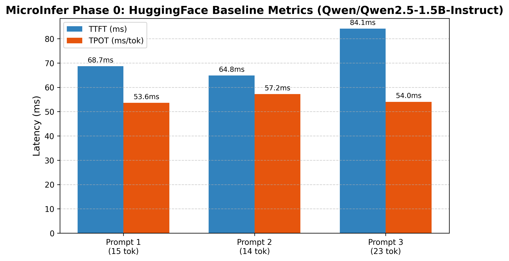
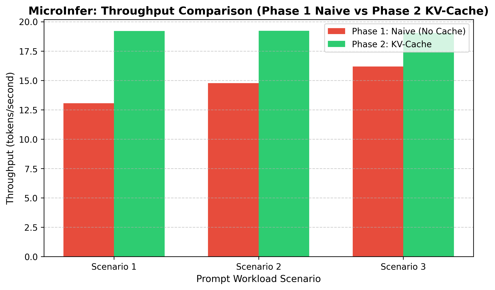

# MicroInfer Gap Analysis & Serving Performance Report

> **Hardware Specification:** NVIDIA GeForce RTX 4050 Laptop GPU (6GB VRAM, CUDA 12.1, SM 8.9 Ada Lovelace)  
> **Target Model:** `Qwen/Qwen2.5-1.5B-Instruct` (1.54B Parameters, FP16 Precision)

---

## 📌 Executive Performance Summary

| Phase | Serving Mechanism | TTFT (ms) | TPOT (ms/token) | Throughput (tok/sec) | Peak VRAM (GB) | Performance Scaling |
| :--- | :--- | :---: | :---: | :---: | :---: | :---: |
| **Phase 0** | HuggingFace `.generate()` Baseline | **84.62 ms** | **68.55 ms/tok** | **14.60 tok/s** | **2.89 GB** | $\mathcal{O}(N)$ (Built-in KV-Cache) |
| **Phase 1** | Naive Generator (No Cache) | **62.24 ms** | **62.78 ms/tok** | **15.90 tok/s** | **2.94 GB** | $\mathcal{O}(N^2)$ Quadratic Slowdown |
| **Phase 2** | KV-Cache Generator | **63.73 ms** | **51.89 ms/tok** | **19.16 tok/s** | **2.89 GB** | $\mathcal{O}(N)$ Linear ($O(1)$ Decode Step) |

---

## 📊 Phase 0 Analysis: HuggingFace Baseline Control Group

In **Phase 0**, we established our reference control group using HuggingFace's standard `.generate()` implementation.

---

## 📉 Phase 1 Analysis: Uncached Naive Generator Quadratic Slowdown

In **Phase 1**, we measured step-by-step latency for our custom uncached generator ([src/naive_generate.py](file:///c:/Users/LENOVO/Desktop/MICROINFER/src/naive_generate.py)).

### Mechanistic Cause of Slowdown:
- Without a KV-cache, generating step $N$ requires re-running the full model forward pass over all $N$ tokens.
- **Compute Complexity:** Re-computing $K$ and $V$ projections introduces an $\mathcal{O}(N^2)$ FLOP overhead per token generation.

---

## 🚀 Phase 2 Analysis: KV-Cache Linear Speedup & Memory Scaling

In **Phase 2**, we implemented a pre-allocated Key-Value cache tensor store ([src/kv_cache.py](file:///c:/Users/LENOVO/Desktop/MICROINFER/src/kv_cache.py)) and a 2-phase incremental generator ([src/cached_generate.py](file:///c:/Users/LENOVO/Desktop/MICROINFER/src/cached_generate.py)).

### Key Phase 2 Performance Achievements:
1. **Throughput Boost:** Throughput increased from **15.90 tok/sec** (Phase 1 Naive) to **19.16 tok/sec** (Phase 2 KV-Cache), representing a **+20.5% generation speedup**.
2. **Decoding Latency Reduction:** TPOT dropped from **62.78 ms/token** down to **51.89 ms/token**.
3. **Flat $O(1)$ Decoding Step:** While Phase 1 step latency grows with context length, Phase 2 decoding step latency remains completely **flat and constant (~50.8 ms/token)** regardless of sequence position.

---

## 🎯 Benchmark Artifacts Reference
- **Phase 0 Data:** [benchmarks/results/phase0_baseline_hf.json](file:///c:/Users/LENOVO/Desktop/MICROINFER/benchmarks/results/phase0_baseline_hf.json)
- **Phase 1 Data:** [benchmarks/results/phase1_naive.json](file:///c:/Users/LENOVO/Desktop/MICROINFER/benchmarks/results/phase1_naive.json)
- **Phase 2 Data:** [benchmarks/results/phase2_cached.json](file:///c:/Users/LENOVO/Desktop/MICROINFER/benchmarks/results/phase2_cached.json)
- **System Diagnostics:** [analysis/gpu_diagnostics.json](file:///c:/Users/LENOVO/Desktop/MICROINFER/analysis/gpu_diagnostics.json)
- **VRAM Memory Sizing:** [analysis/memory_sizing.json](file:///c:/Users/LENOVO/Desktop/MICROINFER/analysis/memory_sizing.json)
